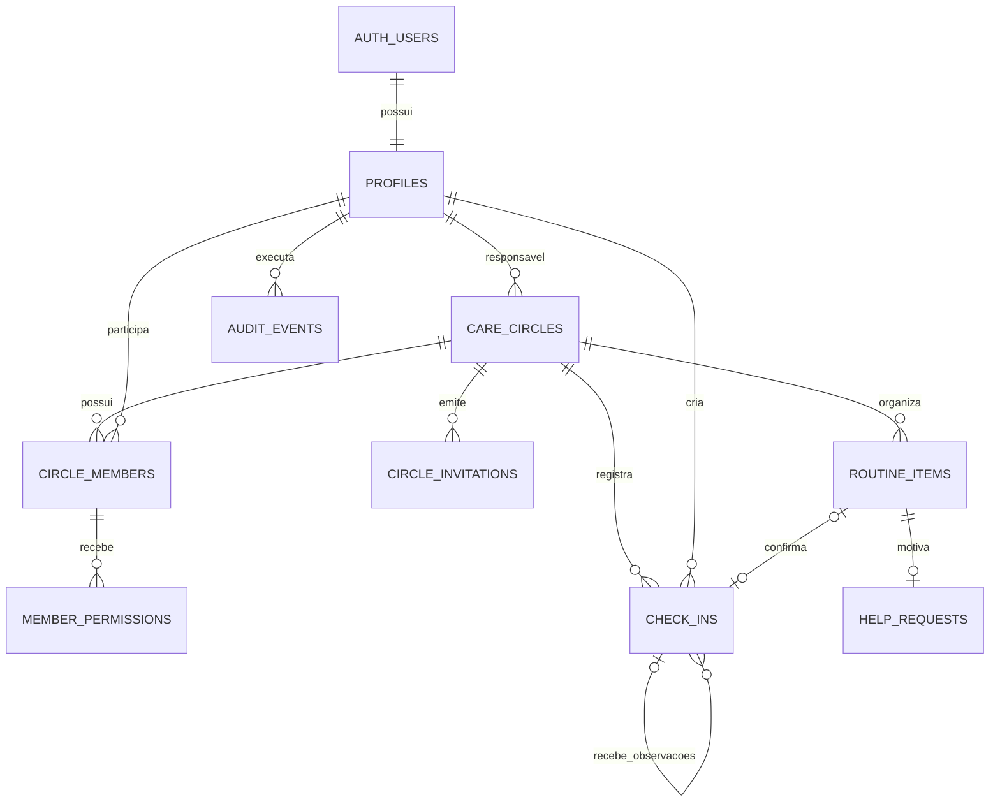

## Modelo Entidade-Relacionamento

```mermaid
erDiagram
    AUTH_USERS ||--|| PROFILES : possui
    PROFILES ||--o{ CARE_CIRCLES : responsavel
    CARE_CIRCLES ||--o{ CIRCLE_MEMBERS : possui
    PROFILES ||--o{ CIRCLE_MEMBERS : participa
    CIRCLE_MEMBERS ||--o{ MEMBER_PERMISSIONS : recebe
    CARE_CIRCLES ||--o{ CIRCLE_INVITATIONS : emite
    CARE_CIRCLES ||--o{ ROUTINE_ITEMS : organiza
    CARE_CIRCLES ||--o{ CHECK_INS : registra
    PROFILES ||--o{ CHECK_INS : cria
    CHECK_INS o|--o{ CHECK_INS : recebe_observacoes
    ROUTINE_ITEMS o|--o| CHECK_INS : confirma
    ROUTINE_ITEMS ||--o| HELP_REQUESTS : motiva
    PROFILES ||--o{ AUDIT_EVENTS : executa
```
